####According to **ERRATA TO VOLUME 1 (UNTIL 2010)**:

  - Errors:

    **Page 505** second display in answer **9** (17 Oct 2007) [*](#note1):

    - Before: 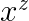
    - (Not modified yet) Should be: 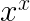

####According to **ERRATA TO VOLUME 1 (AFTER 2010)**:

  - Amendments:

    **Page 476** replacement for answer **4** (22 Dec 2013):

    - Before: **4.** 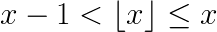; so 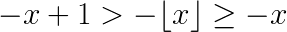; hence the result.
    - Actual: **4.** By part (f), 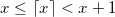; hence 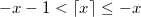; use part (e).

####Errata to the digital edition [**](#note2):

(The app01.html file was a mess, particulary with the images. Some of them incompletes or just incorrect).

  - On id="page\_29":

    - Before: \[...\] is that 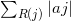 exists.\]
    - Actual: \[...\] is that 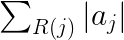 exists.\]

  - On id="page\_29":

    - Before: — that is, if 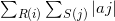 exists —
    - Actual: — that is, if 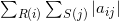 exists —

  - Answer **5** of **Section 1.2.4**:

    - Before: &lt;em&gt;except&lt;/em&gt; when 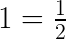.
    - Actual: &lt;em&gt;except&lt;/em&gt; when 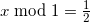.

  - Answer **6** of **Section 1.2.4**:

    - Before: 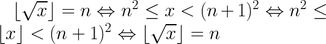
    - Actual: 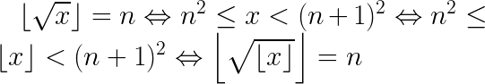

  - Answer **17** of **Section 1.2.7**:

    - Before: By exercise 4.6.2–6, we have 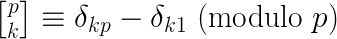
    - Actual: By exercise 4.6.2–6, we have 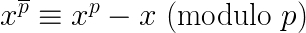

  - Answer **21** of **Section 1.2.8**:

    - Before: \[...\] the solution is 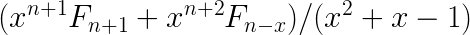
    - Actual: \[...\] the solution is 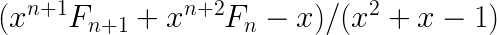

  - Answer **36** of **Section 1.2.8**:

    - Before: \[...\] if and only if 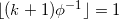
    - Actual: \[...\] if and only if 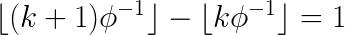

  - Answer **37** of **Section 1.2.8**:

    - Before: &lt;em&gt;Proof:&lt;/em&gt; Let 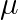
    - Actual: &lt;em&gt;Proof:&lt;/em&gt; Let 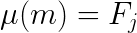;

  - Answer **6** of **Section 1.2.10**:

    - Before: 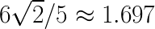
    - Actual:  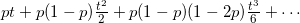

  - Answer **22** of **Section 1.2.10**:

    - Before: \[...\] it is 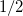.
    - Actual: \[...\] it is 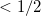.

  - Answer **3** of **Section 1.2.11.2**:

    - Before: \[...\] we have 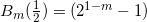.
    - Actual: \[...\] we have 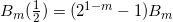.

  - Answer **8** of **Section 1.2.11.3**:

    - Before: 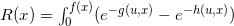
    - Actual: 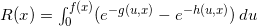

  - Answer **11** of **Section 1.2.11.3**:

    - Before: \[...\] to note that 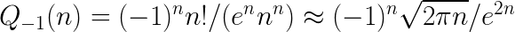
    - Before: \[...\] to note that 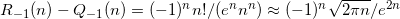

  - Answer **37** of **Section 1.2.8**:

    - Before: 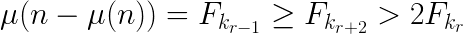
    - Actual: 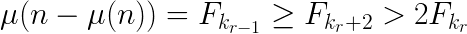

  - Answer **41** of **Section 1.2.8**:

    - Before: 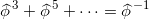
    - Actual: 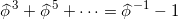

  - Answer **10** of **Section 1.2.9**:

    - Before: **ausent**.
    - Actual: 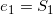,

  - Answer **23** of **Section 1.2.9**:

    - Before: 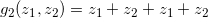
    - Actual: 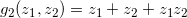

  - On id="page\_172":

    - Before: "We will show below that, if the output permutation is assumed to be random, the quantities &lt;em&gt;U&lt;/em&gt; and &lt;em&gt;υ&lt;/em&gt; will be $H_{N}$ and 1, respectively, on the average."
    - Actual: "We will show below that, if the output permutation is assumed to be random, the quantities &lt;em&gt;U&lt;/em&gt; and &lt;em&gt;V&lt;/em&gt; will be $H_{N}$ and 1, respectively, on the average."

####TODO:

  - Replace &lt;p class="center"&gt;&lt;span class="middle"&gt; for &lt;div class="image"&gt;

[*](#err1) Found it by chance. That's weird, according to the date Knuth applied the fix, that bug should not be there.
This force me to check all the erratas. Later I will.

[**](#title) The list does not include all errors I fixed, only those in which I'm not entirely sure if the correction is correct. Let me know if you find one of my corrections wrong.
